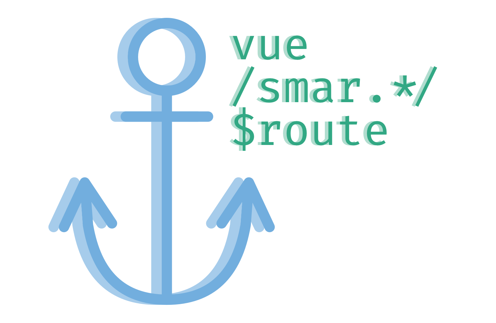
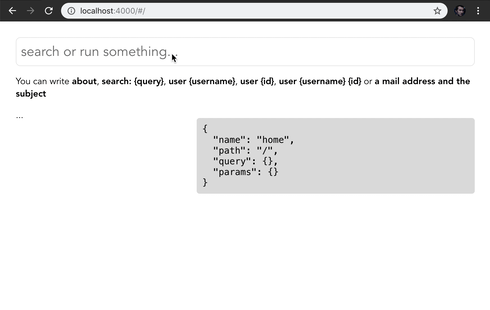
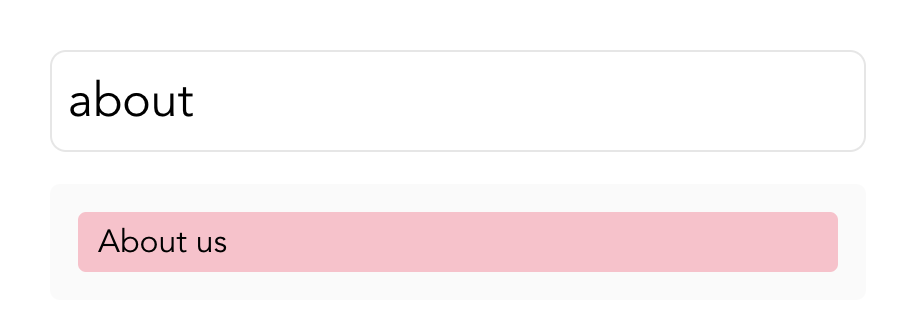
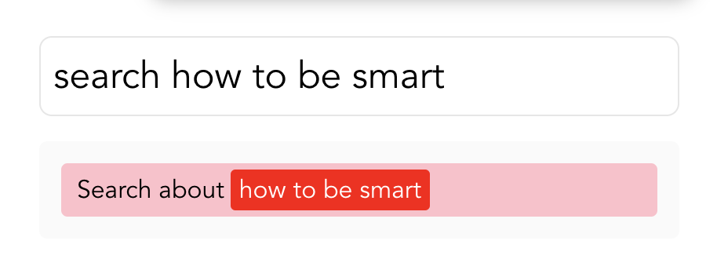
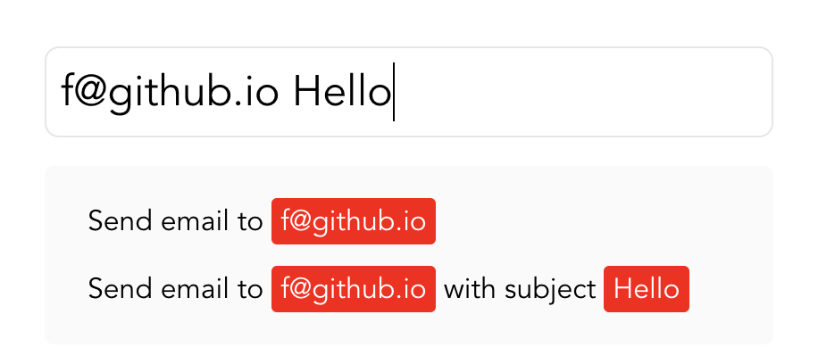

<p align="center">

</p>
<h2 align="center">Make your users dynamically navigate routes, make smart commands and queries with a single directive.</h2>

<p align="center">

</p>

Vue Smart Route allows you to create a **query** system based on your **routes**. You can simply create a command input that creates **smart** actions, both static routes and the **async ones**:

<p align="center">

</p>

## Install

```
yarn add vue-smart-route
```

Then install it:

```js
import Vue from 'vue'
import VueRouter from 'vue-router'
import VueSmartRoute from 'vue-smart-route'

Vue.use(VueRouter)
Vue.use(VueSmartRoute)
```

## Overview

This is a well known route in **VueRouter**:

```js
routes: [
  {
    name: 'about',
    path: '/about'
  }
]
```

To make it **smart route**, just add a `smart` key:

```js
routes: [
  {
    name: 'about',
    path: '/about',
    // Adding smart key with `matcher` and `handler` (optional)
    smart: {
      matcher: {
        search: [/about/],
        title: () => 'About us'
      }
    }
  }
]
```

Then, you need to use **`v-smart-routes`** directive to connect poosible routes you asked with **`search`**:

```vue
<template>
  <input type="text" v-model="search" v-smart-routes="routes">
</template>

<script>
export default {
  data () {
    return {
      search: '',
      routes: []
    }
  }
}
</script>
```

Now, `routes` and `search` are connected eachother and `routes` will be **smartly calculated** according to `search` property.

> Following examples are styled. **`vue-smart-route` does not contain any style or component.**



[▶︎ Try in Example](https://f.github.io/vue-smart-route)

You can check `/example` to see a working example.

## Passing Parameters

**vue-smart-route** is simple yet powerful. You can extend your logic to **make your route smarter.**

Let's create a smart `/search` route:

```js
{
  name: 'search',
  path: '/search',
  component: () => import('./Search.vue'),
  smart: {
    matcher: {
      // Named RegExp will be passed to the `title` function:
      search: [/^search\:?\s+(?<query>.+)/i],
      title: ({ query }) => `Search about *${query}*`
    }
  }
}
```



[▶︎ Try in Example](https://f.github.io/vue-smart-route)

When you click to the link, it will be navigated to the `/search?query=how+to+be+smart`.

Then you'll be able to access to the query using `$route.query.query` from your view.

## Passing Optional Parameters

You can simply make your search smarter by adding more logic:

```js
{
  name: 'mail',
  path: '/mail',
  component: () => import('./SendMail.vue'),
  smart: {
    matcher: {
      search: [
        /(?<email>[a-zA-Z0-9.!#$%&’*+/=?^_`{|}~-]+@[a-zA-Z0-9-]+(?:\.[a-zA-Z0-9-]+)*)/i,
        /(?<email>[a-zA-Z0-9.!#$%&’*+/=?^_`{|}~-]+@[a-zA-Z0-9-]+(?:\.[a-zA-Z0-9-]+)*)\s+(?<subject>\w+)/i
      ],
      title({ email, subject }) {
        if (subject) {
          return `Send email to *${email}* with subject *${subject}*`;
        }
        return `Send email to *${email}*`;
      }
    }
  }
}
```

- You can pass multiple `RegExp` for search,
- `title` gets all the named matches and may include logic.



[▶︎ Try in Example](https://f.github.io/vue-smart-route)

It lists all the routes.

## The Directive

vue-smart-route includes only a directive that makes all the magic.

Directive requires to be bound an **input with a `v-model`**, and using `v-smart-routes` you will bind results to another property.

E.g. if you bind `v-smart-routes` to `results` property, it will be an array of route objects.

| key | Type | Description |
| --- | ---- | ----------- |
| `name` | `String` | Route name, e.g. `home` |
| `path` | `String` | Route path, e.g. `/` |
| `title` | `String` | Route title generated by `title` function of the smart route |
| `handler` | `Function` | A function that triggers the navigation. It can be overriden.

## Customizing the `handler` behaviour

`handler` navigates to page by default, but it can be changed.

Let's make `email` example smarter by changing the navigation handler:

```js
{
  name: 'mail',
  path: '/mail',
  component: () => import('./SendMail.vue'),
  smart: {
    matcher: {
      search: [
        /(?<email>[a-zA-Z0-9.!#$%&’*+/=?^_`{|}~-]+@[a-zA-Z0-9-]+(?:\.[a-zA-Z0-9-]+)*)/i,
        /(?<email>[a-zA-Z0-9.!#$%&’*+/=?^_`{|}~-]+@[a-zA-Z0-9-]+(?:\.[a-zA-Z0-9-]+)*)\s+(?<subject>\w+)/i
      ],
      title({ email, subject }) {
        if (subject) {
          return `Send email to *${email}* with subject *${subject}*`;
        }
        return `Send email to *${email}*`;
      }
    },

    // Customizing the handler
    handler(route, next) {
      if (route.query.subject) {
        location.href = `mailto:${route.query.email}?subject=${
          route.query.subject
        }`;
        // Calling next will continue navigation by default, you can redirect or just stop here.
        next(route);
        return;
      }
      location.href = `mailto:${route.query.email}`;
      next(route);
    }
  }
}
```

According to this example, you will be able to navigate your user to the mail application.

## Async Route Generation (Autocomplete-like)

**vue-smart-route** supports `async routes` that you can generate routes on demand, on runtime. To to that, you should use `async routes` method to matcher:

```js
smart: {
  matcher: {
    search: [/swapi\s(?<query>.*)/],
    async routes({ query }) {
      const people = await fetch(`https://swapi.co/api/people/?search=${encodeURIComponent(query)}`).then(r => r.json())
      return people.results.map(character => ({
        name: 'character',
        title: `Go to character *${character.name}*`,
        params: { url: character.url }
      }))
    }
  }
}
```

This will help you to generate new routes dynamically:


## i18n

You can also use `i18n` features in `vue-smart-route`:

`search`, `title` and `handler` takes `ctx` parameters which you can access to current component.

```js
routes: [
  {
    name: 'about',
    path: '/about',
    smart: {
      matcher: {
        search: (ctx) => {
          switch (ctx.$i18n.locale) {
            case 'tr':
              return [/hakkinda/]
            case 'en':
            default:
              return [/about/]
          }
        },
        title: ({}, ctx) => ctx.$i18n.t('navigation.about_us')
      },
      handler (route, next, ctx) {
        location.href = `https://${ctx.i18n.locale}.example.com/about`
      }
    }
  }
]
```

## License

MIT.
